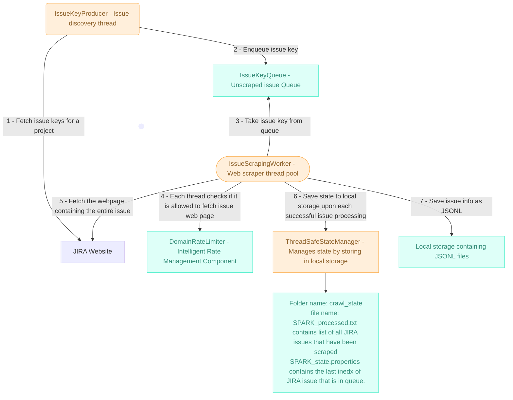

# Jira Web Scraping and Transformation Pipeline

A robust, fault-tolerant Java application that uses web scraping to extract public issue data from Apache's Jira instance and transforms it into a structured JSONL format suitable for training Large Language Models (LLMs).
## Architecture Components



### 1. **IssueKeyQueue** - Unscraped Issue Queue
- **Purpose**: Central queue for managing issue keys that need to be scraped, prevents overlap of scrapping work by multiple scrapping workers.
- **Thread Safety**: Uses `BlockingQueue` for concurrent access
- **Capacity Management**: Configurable capacity to prevent memory issues

### 2. **DomainRateLimiter** - Intelligent Rate Management
- **Purpose**: Domain-specific rate limiting to respect server resources. Can be tweaked to allow Domain+proxy based rate limiting to allow multiple workers to scrape with separate rate limits (assuming use of proxy servers).
- **Separate Thread**: Runs on its own scheduled executor service, to represent the fact that it needs to be hosted as a separate process in prod.
- **Automatic Cleanup**: Removes inactive domain trackers after 10 minutes


### 3. **IssueKeyProducer** - Issue Discovery Thread
- **Purpose**: Continuously discovers new issue keys from JIRA's search pages. Separate thread to represent the fact that it needs to be hosted as a separate process in prod.
- **One Per Project**: Each target project gets its own producer thread
- **State-Aware**: Resumes from last processed position
- **Queue Integration**: Adds discovered issue keys to the central queue
- **Rate Limited**: Respects domain rate limits for search requests

```java
// Producer Workflow
1. Load project state (resume point)
2. Fetch search page with pagination
3. Extract issue keys from HTML
4. Add keys to queue (with backpressure handling)
5. Update pagination and continue
```

### 4. **IssueScrapingWorker** - Web scrapping threads
- **Purpose**: Processes individual issues from the queue, fetches the issue webpage from JIRA and extracts all relevant info. Architected as a separate thread pool to represent the fact that in production, each thread can scrape through a virtual IP, allowing better rate limits.
- **Multiple Workers**: Configurable number of worker threads (4 by default)
- **Independent Processing**: Each worker operates independently
- **Immediate Persistence**: Saves state and data after each successful scrape
- **Fault Tolerant**: Individual failures don't affect other workers

### 5. **ThreadSafeStateManager** - Manages state for every JIRA project
- **Purpose**: Save list of all issues that are processed in a separate file example - SPARK_processed.txt. Keeps index of last issue in queue in SPARK_state.properties. These files are generated per project.
- **Thread safety**: Allows multiple worker threads to update state by using blocking techniques.
- **Immediate Persistence**: Saves state and data after each successful scrape.
- **Production transition**: For production, storing in local storage is not recommended as worker threads may be distributed across multiple servers. An off the shelf key-value store like DynamoDB should be used.

## Features

### Core Capabilities
- **Web scraping approach**: Uses HTML parsing
- **Multi-project scraping**: Extracts data from multiple Apache projects
- **Comprehensive data extraction**: Issues, comments, metadata, status, priority, assignee, labels, timestamps
- **Intelligent pagination**: Handles large datasets with automatic page navigation
- **Rate limiting**: Respects server limits with configurable delays between requests
- **Fault tolerance**: Robust retry logic with exponential backoff for failed requests
- **Resumable crawling**: State management allows resumption after interruptions
- **Multiple training formats**: Generates summarization, classification, Q&A, and conversation tasks

### Reliability Features
- **HTML parsing resilience**: Multiple CSS selectors for robust data extraction
- **Request failure handling**: Automatic retries for network issues
- **HTTP error handling**: Proper handling of 429 (rate limit) and 5xx responses
- **Data validation**: Handles missing or malformed HTML gracefully
- **State persistence**: Saves progress to enable recovery from interruptions
- **User-Agent rotation**: Mimics real browser requests to avoid blocking

### Data Transformation
- **Clean JSONL output**: Structured format optimized for LLM training
- **Multiple task types**: 
  - Summarization tasks (issue description → summary)
  - Classification tasks (content → priority/status)
  - Q&A tasks (context → question/answer pairs)
  - Conversation tasks (issue discussions)
- **Text cleaning**: Removes HTML tags, Jira markup, normalizes whitespace
- **Rich metadata**: Preserves all relevant issue information

## Quick Start

### Prerequisites
- Java 11 or higher (I have only tested on 23)
- Maven 3.6 or higher
- Internet connection for web scraping

### Installation & Running

1. **Clone and build the project:**
```bash
git clone <repository-url>
cd jira-crawler
mvn clean compile
```

2. **Run the crawler:**
```bash
# Full crawl of all configured projects
mvn exec:java

3. **Alternative: Build and run JAR:**
```bash
mvn clean package
java -jar target/jira-crawler-1.0.0-jar-with-dependencies.jar
```

## Configuration

Edit `src/CrawlerConfig.java` to customize:

```java
// Target projects (modify as needed)
public static final List<String> TARGET_PROJECTS = Arrays.asList(
    "ACE", "SPARK", "HADOOP"
);

// Threading Configuration
public static final int WORKER_THREAD_COUNT = 4;      // Concurrent scrapers
public static final int PRODUCER_THREAD_COUNT = 1;    // Per project
public static final int QUEUE_CAPACITY = 1000;        // Max queued tasks

// Rate Limiting
public static final int CRAWL_DELAY_MS = 2000;        // Default domain delay
```

## Output Format

The pipeline generates JSONL files in the `output/` directory with multiple training task formats:

### Summarization Task
```json
{
  "metadata": {
    "issue_key": "KAFKA-12345",
    "project": "KAFKA",
    "task_type": "summarization",
    "created": "2023-01-15T10:30:00.000Z",
    "reporter": "john.doe",
    "labels": ["bug", "performance"]
  },
  "input": "Full issue description and comments...",
  "output": "Concise issue summary",
  "instruction": "Summarize the following software issue in one concise sentence:"
}
```

### Classification Task
```json
{
  "metadata": { ... },
  "input": "Issue title and description...",
  "output": {
    "priority": "Major",
    "status": "Open"
  },
  "instruction": "Classify this software issue by priority and current status:"
}
```

### Q&A Task
```json
{
  "metadata": { ... },
  "context": "Full issue information...",
  "question": "What is the main problem described in this issue?",
  "answer": "Issue summary",
  "instruction": "Answer the question based on the provided context:"
}
```

### Conversation Task
```json
{
  "metadata": { ... },
  "conversation": [
    {
      "role": "system",
      "content": "Issue: Title\nDescription: ..."
    },
    {
      "role": "user",
      "author": "developer1",
      "content": "Comment text...",
      "timestamp": "2023-01-15T11:00:00.000Z"
    }
  ],
  "instruction": "Continue this technical discussion about the software issue:"
}
```

### Manual Recovery
- **State files**: Located in `crawl_state/` directory
- **Resume crawling**: Automatically resumes from last successful position
- **Reset state**: Use `java Main reset <PROJECT>` to start fresh

### Technology Choices
- **Java 11**: Modern language features, excellent HTTP client
- **Jackson**: Robust JSON processing
- **jsoup**: HTML parsing
- **No external databases**: File-based state for simplicity. In prod, an off the shelf DB should be used.